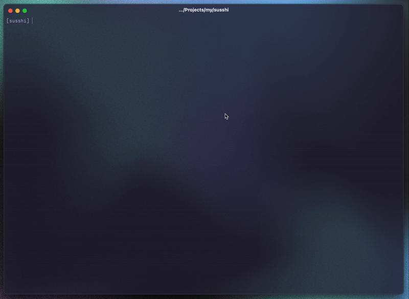

<p align=center>
 
</p>
 <h1 align=center>Susshi</h1>
 
**Susshi** 🍣 - SSH servers at sushi train speed

### **For those who:**
- Live in `ssh` but hate typing hostnames
- Want _visibility_ (no more guessing aliases)
- Demand **Vim keys** in every tool
- Trust `ssh` but crave a better UX
_"It’s `ssh` with a Vim-shaped exoskeleton."_
 

### Install & Usage
```shell
go install github.com/zovenor/susshi/cmd/susshi@latest

susshi
```
### Configure
Example:
```yaml
# $HOME/.config/susshi/config.yaml
ssh_config: $HOME/.ssh/config
hide_icon: false
```
