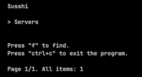

### Go 1.21.4+

### Modify servers

`~/.susshi/servers.json`

For example:

```shell
[
    {
        "address": "0.0.0.0",
        "port": 22,
        "username": "admin",
        "password": "123123123",
        "name": "test ssh server"
    }
]
```

### Install

```shell
make install
```

```shell
susshi
```


